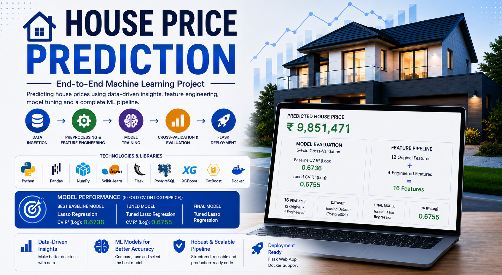

# House Price Prediction

An end-to-end machine learning project for predicting house prices using a production-oriented training, evaluation, and deployment pipeline.

The project ingests housing data from PostgreSQL, performs feature engineering and preprocessing, compares multiple regression models using 5-fold cross-validation, tunes the best-performing baseline model, serializes the final model and preprocessing pipeline, and exposes the prediction system through a Flask web application.



---

## Project Overview

This project demonstrates a complete machine learning workflow rather than a standalone notebook experiment.

The pipeline covers:

* PostgreSQL data ingestion
* Train/test splitting
* Feature engineering
* Data preprocessing
* Target transformation
* 5-fold cross-validation
* Baseline model comparison
* Hyperparameter tuning
* Final model selection
* Model and preprocessor serialization
* Flask deployment
* Docker support
* CI workflow

### End-to-End Workflow

```text
PostgreSQL
    ↓
Data Ingestion
    ↓
Train / Test Split
    ↓
Feature Engineering
    ↓
Data Preprocessing
    ↓
Target Transformation
    ↓
5-Fold Cross-Validation
    ↓
Baseline Model Comparison
    ↓
Hyperparameter Tuning
    ↓
Final Model Selection
    ↓
Model + Preprocessor Serialization
    ↓
Flask Prediction Application
```

The training workflow is divided into dedicated ingestion, transformation, and model-training components and coordinated through a training pipeline.

---

## Key Features

* PostgreSQL-based data ingestion
* Environment-based database configuration
* Automated train/test splitting
* 12 original input features
* 4 engineered features
* 16 total features before one-hot encoding
* Numerical imputation and standardization
* Categorical imputation and one-hot encoding
* Log transformation of the target variable
* 5-fold cross-validation
* Comparison of 10 regression models
* Lasso hyperparameter tuning using `RandomizedSearchCV`
* Automatic inverse transformation of predictions
* Serialized model and preprocessing artifacts
* Flask prediction interface
* Docker support
* GitHub Actions CI workflow
* DVC metadata for dataset tracking
* Modular ML pipeline architecture

---

# Dataset and Features

The project uses a housing dataset containing **12 original input features**.

Four additional features are created through feature engineering, resulting in:

```text
12 Original Features
        +
4 Engineered Features
        =
16 Features
```

The engineered features are created before preprocessing and model training.

---

## Feature Engineering

The following four features are engineered:

```text
total_rooms
area_per_bedroom
area_per_bathroom
amenity_count
```

### Feature Definitions

```text
total_rooms = bedrooms + bathrooms

area_per_bedroom = area / bedrooms

area_per_bathroom = area / bathrooms

amenity_count =
    mainroad
  + guestroom
  + basement
  + hotwaterheating
  + airconditioning
  + prefarea
```

The feature-engineering logic is shared between training and inference so that the same transformations are applied when generating predictions.

---

# Machine Learning Pipeline

## 1. Data Ingestion

The project reads housing data directly from PostgreSQL using SQLAlchemy and a PostgreSQL database driver.

Database credentials are loaded from environment variables rather than being hard-coded into the source code.

### Required Environment Variables

```text
DB_HOST
DB_PORT
DB_NAME
DB_USER
DB_PASSWORD
DB_TABLE
```

The ingestion component:

1. Connects to PostgreSQL
2. Reads the configured table
3. Saves the raw dataset
4. Creates an 80/20 train-test split
5. Saves `train.csv` and `test.csv`

---

## 2. Feature Engineering

Feature engineering is performed consistently during both model training and prediction.

The four engineered features are:

```text
total_rooms
area_per_bedroom
area_per_bathroom
amenity_count
```

These features are designed to provide additional information about property size, room distribution, and available amenities.

---

## 3. Data Preprocessing

The preprocessing pipeline uses separate transformations for numerical and categorical features.

### Numerical Pipeline

```text
Median Imputation
      ↓
StandardScaler
```

Numerical features:

```text
area
bedrooms
bathrooms
stories
parking
total_rooms
area_per_bedroom
area_per_bathroom
amenity_count
```

### Categorical Pipeline

```text
Most-Frequent Imputation
      ↓
One-Hot Encoding
```

Categorical features:

```text
mainroad
guestroom
basement
hotwaterheating
airconditioning
prefarea
furnishingstatus
```

The preprocessing pipeline is fitted only on the training data and subsequently reused for:

* Training transformations
* Test transformations
* Future inference

This prevents inconsistent preprocessing between training and prediction.

---

# Target Transformation

House prices are positively skewed, so the target variable is transformed using a natural logarithmic transformation.

During training:

```python
y_train_log = np.log1p(y_train)
```

Models are therefore trained to predict:

```text
log1p(price)
```

During inference, the predicted value is converted back to the original price scale:

```python
predicted_price = np.expm1(predicted_log_price)
```

This allows the model to operate on a more stable target distribution while presenting predictions in the original currency scale.

---

# Model Comparison

The project evaluates the following 10 baseline regression models:

1. Linear Regression
2. Ridge Regression
3. Lasso Regression
4. ElasticNet
5. Decision Tree
6. Random Forest
7. Extra Trees
8. Gradient Boosting
9. XGBoost
10. CatBoost

All models are evaluated using **5-fold cross-validation** on the log-transformed target.

### Evaluation Metrics

The primary model-selection metric is:

```text
R² on log-transformed target
```

Additional metrics include:

```text
CV R² Standard Deviation
CV MAE on log-transformed target
CV RMSE on log-transformed target
```

---

# Baseline Model Results

| Model                | CV R² (Log) | CV R² Std | CV MAE (Log) | CV RMSE (Log) |
| -------------------- | ----------: | --------: | -----------: | ------------: |
| **Lasso Regression** |  **0.6736** |    0.0366 |       0.1541 |        0.1991 |
| ElasticNet           |      0.6725 |    0.0372 |       0.1542 |        0.1995 |
| Ridge Regression     |      0.6705 |    0.0376 |       0.1546 |        0.2001 |
| Linear Regression    |      0.6700 |    0.0381 |       0.1548 |        0.2002 |
| CatBoost             |      0.6517 |    0.0447 |       0.1554 |        0.2055 |
| Gradient Boosting    |      0.6302 |    0.0498 |       0.1604 |        0.2117 |
| XGBoost              |      0.6299 |    0.0566 |       0.1615 |        0.2117 |
| Random Forest        |      0.6195 |    0.0669 |       0.1614 |        0.2142 |
| Extra Trees          |      0.5988 |    0.0393 |       0.1665 |        0.2209 |
| Decision Tree        |      0.2639 |    0.1648 |       0.2265 |        0.2971 |

The cross-validation leaderboard is automatically generated and saved as:

```text
artifacts/model_comparison_cv.csv
```

### Best Baseline Model

```text
Model: Lasso Regression
CV R² (Log): 0.6736
```

Lasso Regression achieved the highest mean cross-validation R² among the evaluated baseline models.

---

# Hyperparameter Tuning

Since Lasso Regression achieved the highest baseline cross-validation performance, it was selected for hyperparameter tuning.

`RandomizedSearchCV` was used to search for an improved value of the Lasso regularization parameter `alpha`.

### Search Space

```python
np.logspace(-5, 1, 50)
```

### Search Configuration

```text
Candidates: 30
Cross-validation folds: 5
Scoring: R²
Random state: 42
```

### Tuning Results

```text
Baseline Lasso CV R² : 0.6736
Tuned Lasso CV R²    : 0.6755
Improvement           : +0.0019
```

Best parameter:

```text
alpha = 0.0021209508879201904
```

### Final Model

```text
Tuned Lasso Regression
CV R² (Log): 0.6755
```

The tuning process only replaces the baseline Lasso model when the tuned configuration produces an improved cross-validation score.

In this experiment, tuning produced a modest improvement of approximately **0.0019 CV R²**.

---

# Final Model Selection

The final model selected by the pipeline is:

```text
Tuned Lasso Regression
```

Performance:

```text
5-Fold CV R² (Log): 0.6755
```

The final model is trained using the selected configuration and serialized together with the preprocessing pipeline.

The prediction pipeline then loads these artifacts during inference.

---

# Model Artifacts

The trained model and preprocessing objects are stored in the `artifacts` directory.

```text
artifacts/
├── final_model_report.txt
├── model_comparison_cv.csv
├── model.pkl
├── preprocessor.pkl
├── raw.csv
├── raw.csv.dvc
├── train.csv
└── test.csv
```

### Important Files

#### `model.pkl`

Serialized final trained model.

#### `preprocessor.pkl`

Serialized preprocessing pipeline used during training and prediction.

#### `model_comparison_cv.csv`

5-fold cross-validation leaderboard containing the baseline model comparison.

#### `final_model_report.txt`

Final model performance report generated after training.

The prediction pipeline loads both:

```text
artifacts/model.pkl
artifacts/preprocessor.pkl
```

during inference.

---

# Web Application

A Flask web application provides an interface for entering house characteristics and receiving an estimated house price.

### Prediction Inputs

The application accepts the following inputs:

```text
Area
Bedrooms
Bathrooms
Stories
Parking Spaces
Main Road Access
Guest Room
Basement
Hot Water Heating
Air Conditioning
Preferred Area
Furnishing Status
```

The submitted values are passed through the same feature-engineering and preprocessing logic used during training before generating the final prediction.

---

# Screenshots

## Prediction Form


## Prediction Result


## Cross-Validation Leaderboard


## Model Tuning and Final Selection


---

# Project Structure

```text
House_Price_Prediction/
│
├── .github/
│   └── workflows/
│       └── ci.yml
│
├── artifacts/
│   ├── final_model_report.txt
│   ├── model_comparison_cv.csv
│   ├── model.pkl
│   ├── preprocessor.pkl
│   ├── raw.csv
│   ├── raw.csv.dvc
│   ├── train.csv
│   └── test.csv
│
├── notebook/
│   └── Data/
│       ├── EDA.ipynb
│       ├── Model_Trainer.ipynb
│       ├── final_house_price_model.pkl
│       ├── model_comparison_cv.csv
│       └── raw.csv
│
├── ScreenShots/
│   ├── house-price-prediction-banner.png
│   ├── 01_Prediction_Form.png
│   ├── 02_Prediction_Result.png
│   ├── 03_CV_Leaderboard.png
│   └── 04_Model_Tuning.png
│
├── src/
│   └── house_price_prediction/
│       ├── components/
│       │   ├── data_ingestion.py
│       │   ├── data_transformation.py
│       │   └── model_trainer.py
│       │
│       ├── pipelines/
│       │   ├── prediction_pipeline.py
│       │   └── training_pipeline.py
│       │
│       ├── exception.py
│       ├── feature_engineering.py
│       ├── logger.py
│       └── utils.py
│
├── app.py
├── Dockerfile
├── requirements.txt
├── setup.py
└── README.md
```

---

# Installation

## 1. Clone the Repository

```bash
git clone https://github.com/Aryan-1105/House_Price_Prediction.git
cd House_Price_Prediction
```

## 2. Create a Virtual Environment

### Windows

```powershell
python -m venv venv
venv\Scripts\activate
```

### macOS / Linux

```bash
python3 -m venv venv
source venv/bin/activate
```

## 3. Install Dependencies

```bash
pip install -r requirements.txt
```

The project dependencies include libraries for:

* Data processing
* Machine learning
* PostgreSQL connectivity
* Flask
* Model serialization
* Visualization
* Environment configuration

The complete dependency list is maintained in:

```text
requirements.txt
```

---

# PostgreSQL Configuration

Create a `.env` file in the project root.

Example:

```env
DB_HOST=localhost
DB_PORT=5432
DB_NAME=your_database_name
DB_USER=your_username
DB_PASSWORD=your_password
DB_TABLE=your_table_name
```

Do **not** commit your `.env` file to GitHub.

The project loads these values using `python-dotenv` and uses them to construct the PostgreSQL connection.

---

# Training the Model

Run the complete training pipeline from the project root:

```bash
python -m src.house_price_prediction.pipelines.training_pipeline
```

The pipeline performs:

```text
1. PostgreSQL data ingestion
2. Train/test split
3. Feature engineering
4. Data preprocessing
5. Target transformation
6. 5-fold cross-validation
7. Baseline model comparison
8. Lasso hyperparameter tuning
9. Final model selection
10. Final model training
11. Model and preprocessor serialization
12. Final report generation
```

The training pipeline coordinates the project's data ingestion, transformation, and model-training components.

---

# Running the Flask Application

After the model artifacts have been generated:

```bash
python app.py
```

The application runs locally at:

```text
http://localhost:5000
```

The Flask application loads:

```text
artifacts/model.pkl
artifacts/preprocessor.pkl
```

and uses them to generate house-price predictions.

---

# Docker

The project includes a Dockerfile for containerized execution.

### Build the Docker Image

```bash
docker build -t house-price-prediction .
```

### Run the Container

```bash
docker run -p 5000:5000 house-price-prediction
```

Then open:

```text
http://localhost:5000
```

Docker provides a consistent environment for running the Flask prediction application.

---

# Technologies Used

## Programming Language

* Python

## Data Processing

* Pandas
* NumPy

## Machine Learning

* Scikit-learn
* XGBoost
* CatBoost

## Database

* PostgreSQL
* SQLAlchemy
* psycopg2

## Web Development

* Flask

## Model Serialization

* Dill

## Visualization

* Matplotlib
* Seaborn

## DevOps and Engineering

* Docker
* Git
* GitHub Actions
* DVC

---

# Engineering Practices

This project follows several production-oriented machine learning engineering practices:

* Separation of data ingestion, transformation, and model training
* Modular pipeline architecture
* Reusable feature-engineering logic
* Persisted preprocessing pipeline
* Consistent preprocessing between training and inference
* Cross-validation for model selection
* Hyperparameter tuning
* Serialized model artifacts
* Environment-based database configuration
* Logging and exception handling
* Dockerized application
* GitHub Actions CI workflow
* Dataset versioning metadata using DVC

---

# Evaluation Methodology

The model-selection process uses:

```text
Cross-Validation: 5-Fold
Target: log1p(price)
Primary Metric: R²
```

The final reported cross-validation performance is:

```text
Tuned Lasso CV R² (Log): 0.6755
```

This value represents R² calculated on the **log-transformed target**, not the original house-price scale.

Therefore, it should not be directly compared with an R² value calculated using untransformed prices.

The baseline Lasso achieved:

```text
CV R² (Log): 0.6736
```

After hyperparameter tuning:

```text
CV R² (Log): 0.6755
```

Resulting improvement:

```text
+0.0019
```

The final model is selected based on cross-validation performance and then trained using the selected configuration before being serialized for inference.

---

# Limitations

* The dataset is relatively small compared with real-world property datasets.
* Predictions depend heavily on the quality and distribution of the training data.
* The model does not incorporate detailed geographic information such as exact location, neighborhood, latitude, or longitude.
* Changing housing-market conditions are not explicitly modeled.
* The current tuning stage focuses on Lasso after baseline model comparison rather than extensively tuning every candidate model.
* The dataset may not represent current market prices across different regions.
* Prediction uncertainty is not currently exposed to the user.

---

# Future Improvements

Potential improvements include:

* Add location-based features
* Introduce external housing-market data
* Tune XGBoost and CatBoost
* Compare additional ensemble models
* Add SHAP-based model explainability
* Add prediction confidence intervals
* Add automated model monitoring
* Add automated model retraining
* Add REST API endpoints
* Deploy the application to a cloud platform
* Add MLflow experiment tracking
* Improve CI/CD automation
* Add automated data validation
* Add model performance monitoring after deployment

---

# Author

**Aryan Kumar Sahoo**

* GitHub: `Aryan-1105`
* LinkedIn: `Aryan Kumar Sahoo`

---

# License

This project is intended for educational and portfolio purposes.
