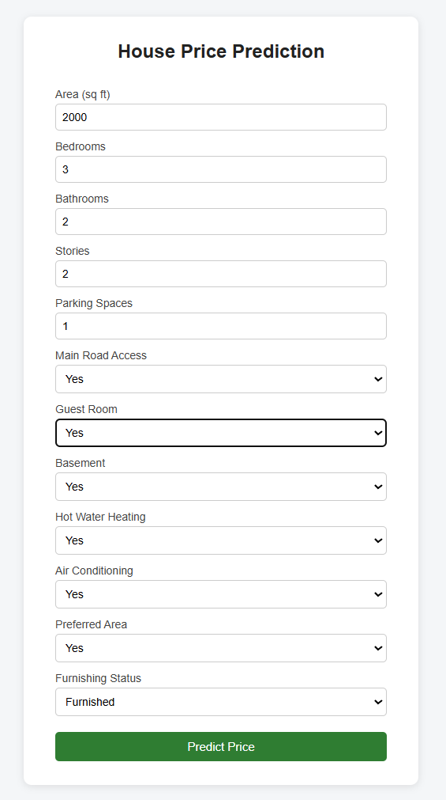
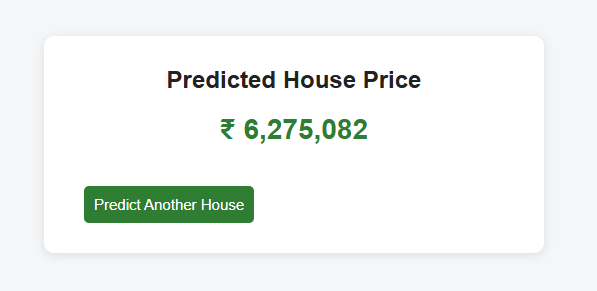
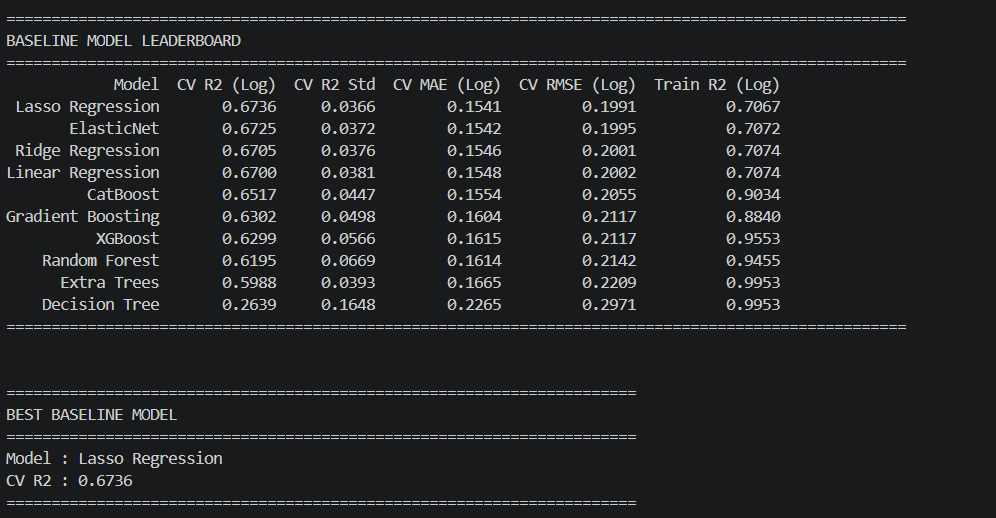
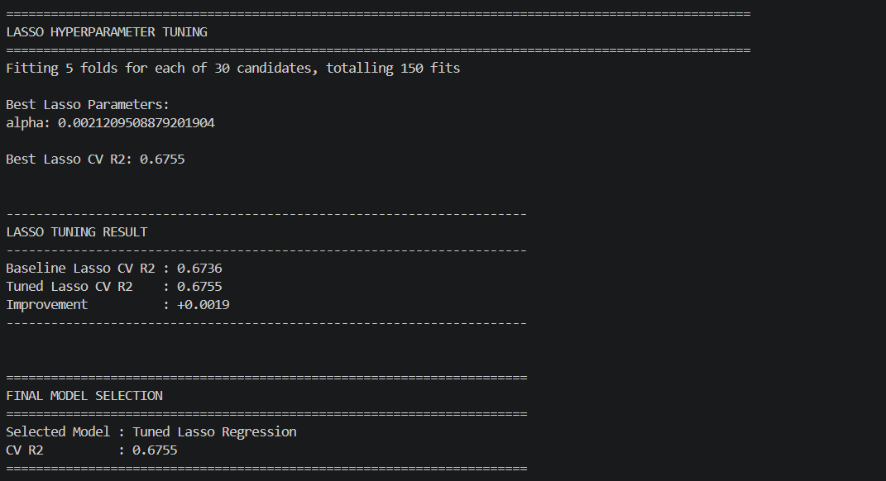

# House Price Prediction

An end-to-end machine learning project for predicting house prices using a complete training and deployment pipeline.

The project reads housing data from PostgreSQL, performs feature engineering and preprocessing, compares multiple regression models using 5-fold cross-validation, tunes the best baseline model, saves the trained model and preprocessor, and exposes the prediction system through a Flask web application.

---

## Project Overview

This project demonstrates a complete machine learning workflow rather than a standalone notebook experiment.

### Workflow

```text
PostgreSQL
    ↓
Data Ingestion
    ↓
Train / Test Split
    ↓
Feature Engineering
    ↓
Data Preprocessing
    ↓
5-Fold Cross-Validation
    ↓
Baseline Model Comparison
    ↓
Hyperparameter Tuning
    ↓
Final Model Selection
    ↓
Model + Preprocessor Serialization
    ↓
Flask Prediction Application
```

The training pipeline is implemented through separate ingestion, transformation, and model-training components, coordinated by a dedicated training pipeline.

---

## Key Features

* PostgreSQL-based data ingestion
* Automated train/test splitting
* Feature engineering
* Numerical imputation and standardization
* Categorical imputation and one-hot encoding
* 5-fold cross-validation
* Multiple regression model comparison
* Lasso hyperparameter tuning using `RandomizedSearchCV`
* Log transformation of the target variable
* Automatic inverse transformation of predictions
* Saved model and preprocessing artifacts
* Flask-based prediction interface
* Docker support
* GitHub Actions CI workflow
* DVC metadata for dataset tracking

---

## Machine Learning Pipeline

### 1. Data Ingestion

The project reads the dataset directly from PostgreSQL using SQLAlchemy and `psycopg2`.

Database credentials are loaded from environment variables rather than being hard-coded.

Required environment variables:

```text
DB_HOST
DB_PORT
DB_NAME
DB_USER
DB_PASSWORD
DB_TABLE
```

The ingestion component:

1. Connects to PostgreSQL
2. Reads the configured table
3. Saves the raw dataset
4. Creates an 80/20 train-test split
5. Saves `train.csv` and `test.csv`

---

## 2. Feature Engineering

The following engineered features are created:

```text
total_rooms
area_per_bedroom
area_per_bathroom
amenity_count
```

### Feature definitions

```text
total_rooms = bedrooms + bathrooms

area_per_bedroom = area / bedrooms

area_per_bathroom = area / bathrooms

amenity_count =
    mainroad
  + guestroom
  + basement
  + hotwaterheating
  + airconditioning
  + prefarea
```

The feature-engineering logic is shared between training and inference so that the same transformations are applied when making predictions.

---

## 3. Data Preprocessing

### Numerical features

The numerical pipeline applies:

```text
Median Imputation
      ↓
StandardScaler
```

Numerical features:

```text
area
bedrooms
bathrooms
stories
parking
total_rooms
area_per_bedroom
area_per_bathroom
amenity_count
```

### Categorical features

The categorical pipeline applies:

```text
Most-Frequent Imputation
      ↓
One-Hot Encoding
```

Categorical features:

```text
mainroad
guestroom
basement
hotwaterheating
airconditioning
prefarea
furnishingstatus
```

The preprocessor is fitted on training data and then reused for the test set and future predictions.

---

## 4. Target Transformation

Because house prices are positively skewed, the target is transformed using:

```python
y_train_log = np.log1p(y_train)
```

Models are trained on the log-transformed price.

During inference, predictions are converted back to the original price scale using:

```python
np.expm1(predicted_log_price)
```

This same transformation logic is used in the prediction pipeline.

---

# Model Comparison

The project evaluates the following baseline regression models:

1. Linear Regression
2. Ridge Regression
3. Lasso Regression
4. ElasticNet
5. Decision Tree
6. Random Forest
7. Extra Trees
8. Gradient Boosting
9. XGBoost
10. CatBoost

Evaluation is performed using **5-fold cross-validation** with the log-transformed target.

---

## Baseline Model Results

| Model                | CV R² (Log) | CV R² Std | CV MAE (Log) | CV RMSE (Log) |
| -------------------- | ----------: | --------: | -----------: | ------------: |
| **Lasso Regression** |  **0.6736** |    0.0366 |       0.1541 |        0.1991 |
| ElasticNet           |      0.6725 |    0.0372 |       0.1542 |        0.1995 |
| Ridge Regression     |      0.6705 |    0.0376 |       0.1546 |        0.2001 |
| Linear Regression    |      0.6700 |    0.0381 |       0.1548 |        0.2002 |
| CatBoost             |      0.6517 |    0.0447 |       0.1554 |        0.2055 |
| Gradient Boosting    |      0.6302 |    0.0498 |       0.1604 |        0.2117 |
| XGBoost              |      0.6299 |    0.0566 |       0.1615 |        0.2117 |
| Random Forest        |      0.6195 |    0.0669 |       0.1614 |        0.2142 |
| Extra Trees          |      0.5988 |    0.0393 |       0.1665 |        0.2209 |
| Decision Tree        |      0.2639 |    0.1648 |       0.2265 |        0.2971 |

The current baseline leaderboard is generated automatically and saved as:

```text
artifacts/model_comparison_cv.csv
```

---

# Hyperparameter Tuning

Lasso Regression achieved the highest baseline cross-validation R².

Therefore, Lasso was selected for hyperparameter tuning using `RandomizedSearchCV`.

### Search space

```python
np.logspace(-5, 1, 50)
```

### Search configuration

```text
Number of candidates: 30
Cross-validation folds: 5
Scoring: R²
Random state: 42
```

### Tuning result

```text
Baseline Lasso CV R² : 0.6736
Tuned Lasso CV R²    : 0.6755
Improvement           : +0.0019
```

Best parameter:

```text
alpha = 0.0021209508879201904
```

### Final selected model

```text
Tuned Lasso Regression
CV R² (Log): 0.6755
```

The tuning logic only replaces the baseline Lasso when the tuned configuration actually improves its cross-validation score.

---

# Model Artifacts

The trained model and preprocessing objects are stored in the `artifacts` directory.

```text
artifacts/
├── final_model_report.txt
├── model_comparison_cv.csv
├── model.pkl
├── preprocessor.pkl
├── raw.csv
├── raw.csv.dvc
├── train.csv
└── test.csv
```

### Important files

**`model.pkl`**

Serialized final trained model.

**`preprocessor.pkl`**

Serialized preprocessing pipeline used during training and prediction.

**`model_comparison_cv.csv`**

5-fold cross-validation leaderboard.

**`final_model_report.txt`**

Final model performance report generated after training.

The prediction pipeline loads both `model.pkl` and `preprocessor.pkl` during inference.

---

# Web Application

A Flask web application provides a simple interface for entering house characteristics and receiving an estimated house price.

### Input features

```text
Area
Bedrooms
Bathrooms
Stories
Parking Spaces
Main Road Access
Guest Room
Basement
Hot Water Heating
Air Conditioning
Preferred Area
Furnishing Status
```

The Flask application sends these inputs through the same feature engineering and preprocessing pipeline used during model training before generating the final prediction.

---

# Screenshots

## Prediction Form



## Prediction Result



## Cross-Validation Leaderboard



## Model Tuning and Final Selection



---

# Project Structure

```text
House_Price_Prediction/
│
├── .github/
│   └── workflows/
│       └── ci.yml
│
├── artifacts/
│   ├── final_model_report.txt
│   ├── model_comparison_cv.csv
│   ├── model.pkl
│   ├── preprocessor.pkl
│   ├── raw.csv
│   ├── raw.csv.dvc
│   ├── train.csv
│   └── test.csv
│
├── notebook/
│   └── Data/
│       ├── EDA.ipynb
│       ├── Model_Trainer.ipynb
│       ├── final_house_price_model.pkl
│       ├── model_comparison_cv.csv
│       └── raw.csv
│
├── ScreenShots/
│   ├── 01_Prediction_Form.png
│   ├── 02_Prediction_Result.png
│   ├── 03_CV_Leaderboard.png
│   └── 04_Model_Tuning.png
│
├── src/
│   └── house_price_prediction/
│       ├── components/
│       │   ├── data_ingestion.py
│       │   ├── data_transformation.py
│       │   └── model_trainer.py
│       │
│       ├── pipelines/
│       │   ├── prediction_pipeline.py
│       │   └── training_pipeline.py
│       │
│       ├── exception.py
│       ├── feature_engineering.py
│       ├── logger.py
│       └── utils.py
│
├── app.py
├── Dockerfile
├── requirements.txt
├── setup.py
└── README.md
```

---

# Installation

## 1. Clone the repository

```bash
git clone https://github.com/Aryan-1105/House_Price_Prediction.git
cd House_Price_Prediction
```

## 2. Create a virtual environment

### Windows

```powershell
python -m venv venv
venv\Scripts\activate
```

### macOS / Linux

```bash
python3 -m venv venv
source venv/bin/activate
```

## 3. Install dependencies

```bash
pip install -r requirements.txt
```

The project dependencies include pandas, NumPy, scikit-learn, Flask, SQLAlchemy, psycopg2, CatBoost, XGBoost, python-dotenv, dill, Matplotlib, and Seaborn.

---

# PostgreSQL Configuration

Create a `.env` file in the project root.

Example:

```env
DB_HOST=localhost
DB_PORT=5432
DB_NAME=your_database_name
DB_USER=your_username
DB_PASSWORD=your_password
DB_TABLE=your_table_name
```

Do **not** commit your `.env` file to GitHub.

The project loads these values using `python-dotenv` and uses them to construct the PostgreSQL connection.

---

# Training the Model

Run the complete training pipeline from the project root:

```bash
python -m src.house_price_prediction.pipelines.training_pipeline
```

The pipeline executes:

```text
1. PostgreSQL data ingestion
2. Train/test split
3. Feature engineering
4. Preprocessing
5. 5-fold cross-validation
6. Model comparison
7. Lasso hyperparameter tuning
8. Final model selection
9. Final model training
10. Model and preprocessor serialization
11. Report generation
```

The project uses a dedicated training pipeline that connects the three main components: data ingestion, transformation, and model training.

---

# Running the Flask Application

After the model artifacts have been generated:

```bash
python app.py
```

The application runs on:

```text
http://localhost:5000
```

The application loads the saved model and preprocessing pipeline from:

```text
artifacts/model.pkl
artifacts/preprocessor.pkl
```

and uses them to generate predictions.

---

# Docker

The project includes a Dockerfile based on Python 3.10.

### Build the image

```bash
docker build -t house-price-prediction .
```

### Run the container

```bash
docker run -p 5000:5000 house-price-prediction
```

Then open:

```text
http://localhost:5000
```

The Docker configuration installs the project requirements, copies the project into the container, exposes port `5000`, and starts the Flask application.

---

# Technologies Used

### Programming Language

* Python

### Data Processing

* Pandas
* NumPy

### Machine Learning

* Scikit-learn
* XGBoost
* CatBoost

### Database

* PostgreSQL
* SQLAlchemy
* psycopg2

### Web Development

* Flask

### Model Serialization

* Dill

### Visualization

* Matplotlib
* Seaborn

### DevOps / Engineering

* Docker
* Git
* GitHub Actions
* DVC

The dependency list is defined in `requirements.txt`.

---

# Engineering Practices

This project follows several practices used in production-oriented ML workflows:

* Separation of data ingestion, transformation, and model training
* Reusable feature-engineering function
* Persisted preprocessing pipeline
* Cross-validation instead of relying only on a single split for model selection
* Hyperparameter tuning
* Serialized model artifacts
* Environment-based database configuration
* Exception handling
* Logging
* Dockerized application
* CI workflow
* Dataset versioning metadata with DVC

---

# Evaluation Notes

The current model-selection process evaluates models using:

```text
5-Fold Cross-Validation
Target: log1p(price)
Primary metric: R²
```

Therefore, the reported:

```text
CV R² (Log) = 0.6755
```

should **not** be directly compared with an earlier experiment that reported R² on the original price scale.

The final model is selected using cross-validation performance and then trained on the complete training split before being evaluated on the held-out test set.

---

# Limitations

* The dataset is relatively small compared with real-world property datasets.
* Predictions depend heavily on the quality and distribution of the training data.
* The model does not incorporate geographic information such as exact location, neighborhood, latitude, or longitude.
* Market conditions and changing property prices are not explicitly modeled.
* The current tuning stage focuses on Lasso after baseline comparison rather than performing exhaustive tuning for every candidate model.

---

# Future Improvements

Potential improvements include:

* Add location-based features
* Introduce external housing-market data
* Compare additional ensemble models
* Tune XGBoost and CatBoost
* Add model explainability using SHAP
* Add prediction confidence intervals
* Add automated model monitoring
* Add automated retraining
* Add API endpoints in addition to the Flask web interface
* Deploy the application to a cloud platform
* Add experiment tracking using MLflow
* Improve CI/CD automation

---

# Author

**Aryan Kumar Sahoo**

GitHub:
https://github.com/Aryan-1105

LinkedIn:
https://www.linkedin.com/in/aryan-kumar-sahoo/

---

# License

This project is intended for educational and portfolio purposes.
